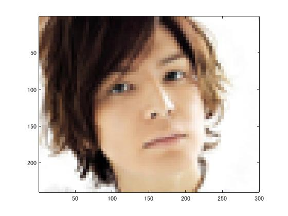
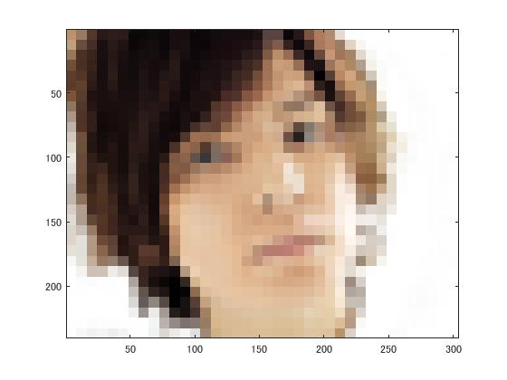
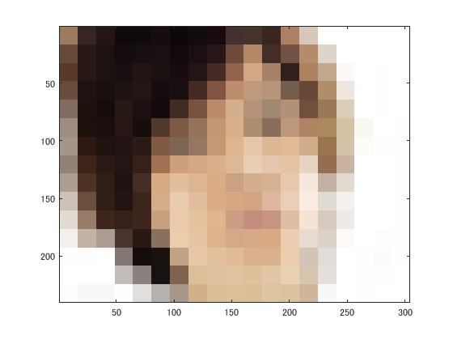
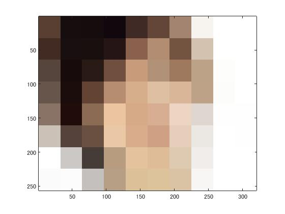

# 課題１レポート

標準画像「生田斗真」を原画像とする．この画像は縦300画像，横240画素による正方形のディジタルカラー画像である．

ORG=imread('http://ks.c.yimg.jp/res/chie-que-10141/10/141/933/305/i320'); % 原画像の入力  
imagesc(ORG); axis image; % 画像の表示

によって，原画像を読み込み，表示した結果を図１に示す．

  
図1 原画像

原画像を1/2サンプリングするには，画像を1/2倍に縮小した後，2倍に拡大すればよい．なお，拡大する際には，単純補間するために「box」オプションを設定する．

IMG = imresize(ORG,0.5); % 画像の縮小  
IMG2 = imresize(IMG,2,'box'); % 画像の拡大

1/2サンプリングの結果を図２に示す．

  
図2 1/2サンプリング

同様に原画像を1/4サンプリングするには，画像を1/2倍に縮小した後，2倍に拡大すればよい．すなわち，

IMG = imresize(ORG,0.5); % 画像の縮小  
IMG2 = imresize(IMG,2,'box'); % 画像の拡大

とする．1/4サンプリングの結果を図３に示す．

  
図3 1/4サンプリング

1/8から1/32サンプリングは，

IMG = imresize(ORG,0.5); % 画像の縮小  
IMG2 = imresize(IMG,2,'box'); % 画像の拡大

を繰り返す．サンプリングの結果を図４～６に示す．

  
図4 1/8サンプリング

  
図5 1/16サンプリング

  
図6 1/32サンプリング

このようにサンプリング幅が大きくなると，モザイク状のサンプリング歪みが発生することがわかる．
