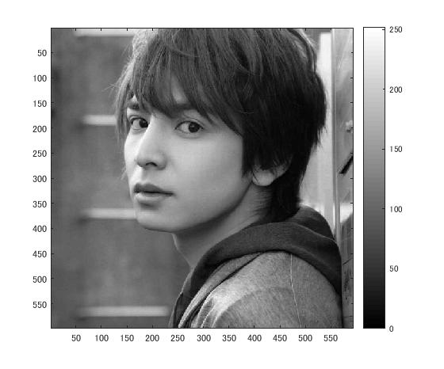
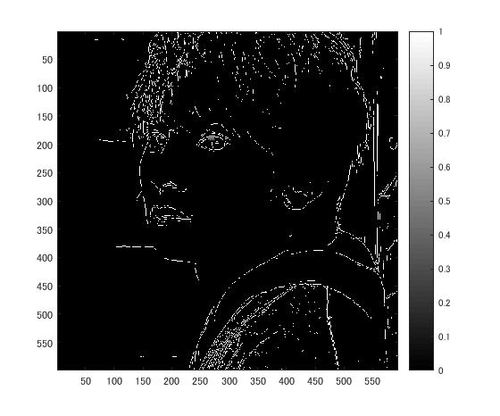
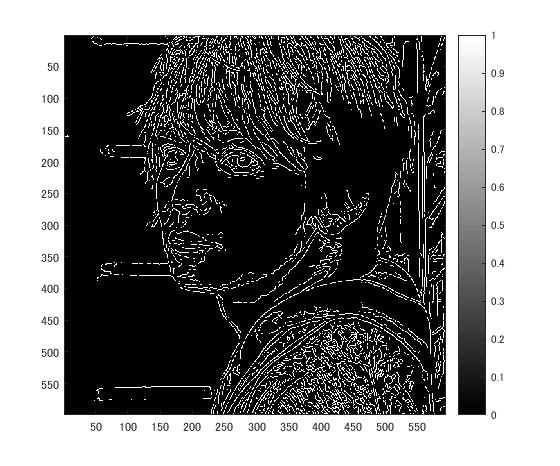

# 課題10レポート

標準画像「生田斗真」を原画像とする．この画像は縦594画像，横599画素による長方形のディジタルカラー画像である．

ORG = imread('http://jinfo.jp/wp-content/uploads/2014/06/%E7%94%9F%E7%94%B0%E6%96%97%E7%9C%9F-%E7%94%BB%E5%83%8F.jpg'); % 原画像の入力
ORG = rgb2gray(ORG); %カラーからグレイへの変換
imagesc(ORG); colormap('gray'); colorbar;% 画像表示

によって，原画像をグレースケールに変換した結果を図１に示す．

  
図1 グレースケール化された原画像

IMG = edge(ORG,'prewitt'); % エッジ抽出（プレウィット法）
imagesc(IMG); colormap('gray'); colorbar;% 画像表示

  
図2 ブレウィット法によりエッジ抽出した画像

IMG = edge(ORG,'sobel'); % エッジ抽出（ソベル法）
imagesc(IMG); colormap('gray'); colorbar;% 画像表示

  
図3 ソルベ法によりエッジ抽出した画像

IMG = edge(ORG,'canny'); % エッジ抽出（キャニー法）
imagesc(IMG); colormap('gray'); colorbar;% 画像表示

  
図4 キャニー法によってエッジ抽出した画像

　今回用いた画像ではブレウィット法とソルベ法の違いはあまり分からなかったが、
キャニー法ではより細かくエッジを抽出することが確認出来た。
