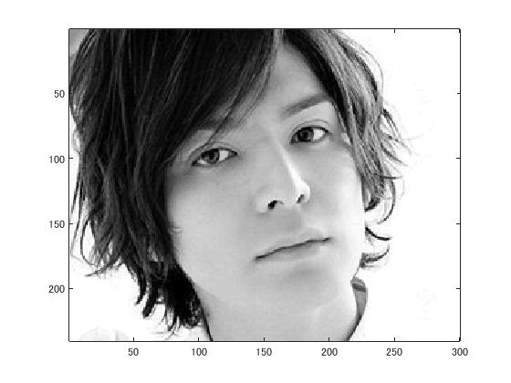
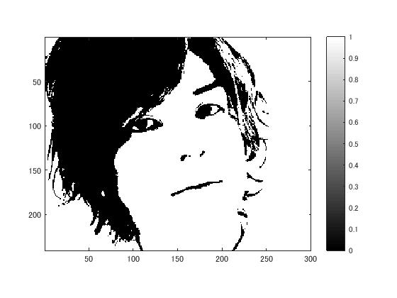
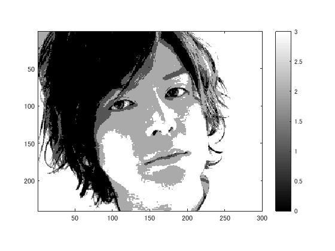

# 課題２レポート

標準画像「生田斗真」を原画像とする．この画像は縦300画像，横240画素による長方形のディジタルカラー画像である．

 ORG=imread('http://ks.c.yimg.jp/res/chie-que-10141/10/141/933/305/i320'); % 原画像の入力 
 ORG = rgb2gray(ORG); colormap(gray); colorbar; 
 imagesc(ORG); axis image; % 画像の表示 

によって，原画像を読み込み，モノクロ表示した結果を図１に示す．

  
図1 モノクロに変換された原画像

原画像を２階調にする

IMG = ORG>128; 
 imagesc(IMG); colormap(gray); colorbar;  axis image; 
 pause; 

2階調のサンプリングの結果を図２に示す．

  
図2 2階調サンプリング

同様に原画像を4階調にサンプリングする.

 IMG0 = ORG>64; 
 IMG1 = ORG>128; 
 IMG2 = ORG>192; 
 IMG = IMG0 + IMG1 + IMG2; 
 imagesc(IMG); colormap(gray); colorbar;  axis image; 
  pause;

とする．4階調のサンプリングの結果を図３に示す．

  
図3 4階調サンプリング

8階調のサンプリングは，

 IMG0 = ORG>32;
 IMG1 = ORG>64;
 IMG2 = ORG>96;
 IMG3 = ORG>128;
 IMG4 = ORG>160;
 IMG5 = ORG>192;
 IMG6 = ORG>224;
 IMG = IMG0 + IMG1 + IMG2 + IMG3 + IMG4 + IMG5 + IMG6;
 imagesc(IMG); colormap(gray); colorbar; axis image;
  pause;
 
   
図4 8階調サンプリング
 
となる。
