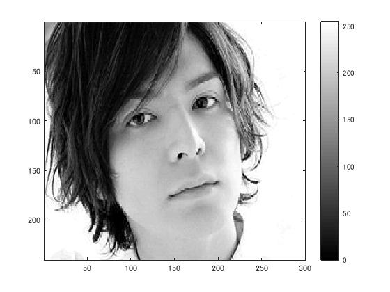
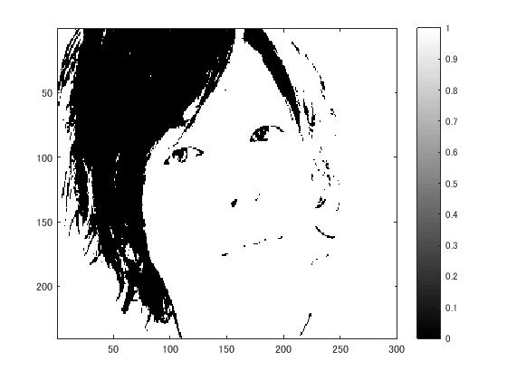
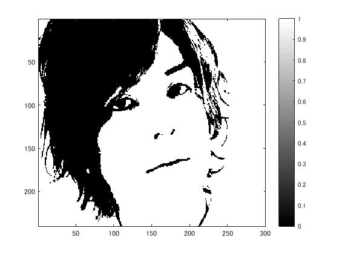
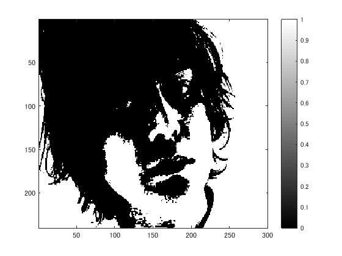

# 課題3レポート

標準画像「生田斗真」を原画像とする．この画像は縦300画像，横240画素による長方形のディジタルモノクロ画像である．

 ORG=imread('http://ks.c.yimg.jp/res/chie-que-10141/10/141/933/305/i320'); % 原画像の入力 
 ORG= rgb2gray(ORG); % カラー画像を白黒濃淡画像へ変換 
 
 imagesc(ORG); colormap(gray); colorbar; % 画像の表示 
 pause; 

によって，原画像を読み込み，表示した結果を図１に示す．

  
図1 モノクロ化された原画像

 IMG = ORG > 64; % 輝度値が64以上の画素を1，その他を0に変換 
 imagesc(IMG); colormap(gray); colorbar; 
 pause; 

結果を図２に示す．

  
図2 原画像の輝度値に閾値64を設定した画像

同様にサンプリングしていく.

 IMG = ORG > 96; 
 imagesc(IMG); colormap(gray); colorbar; 
 pause; 
 
   
図3 原画像の輝度値に閾値96を設定した画像
 
 IMG = ORG > 128; 
 imagesc(IMG); colormap(gray); colorbar; 
 pause; 
 
    
図4 原画像の輝度値に閾値128を設定した画像

 IMG = ORG > 192; 
 imagesc(IMG); colormap(gray); colorbar; 
 
    
図5 原画像の輝度値に閾値192を設定した画像 

となる。

