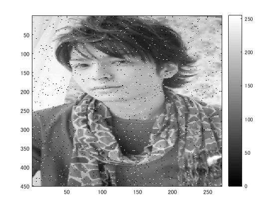

# 課題9レポート

標準画像「生田斗真」を原画像とする．この画像は縦450画像，横270画素による長方形のディジタルカラー画像である．

 ORG = imread('http://www.officiallyjd.com/wp-content/uploads/2012/03/20120316_yoshidakayuriko_26.jpg'); % 画像の読み込み 
 ORG = rgb2gray(ORG); % 白黒濃淡画像に変換 
 imagesc(ORG); colormap(gray); colorbar; % 画像の表示 

によって，原画像を白黒濃淡画像に変換した結果を図１に示す．

  
図1 白黒濃淡化された原画像

 ORG = imnoise(ORG,'salt & pepper',0.02); % ノイズ添付 
 imagesc(ORG); colormap(gray); colorbar; % 画像の表示 

  
図2 塩胡椒ノイズを添付した画像

IMG = filter2(fspecial('average',3),ORG); % 平滑化フィルタで雑音除去 
 imagesc(IMG); colormap(gray); colorbar; % 画像の表示

  
図3 平滑化フィルタを用いてノイズ除去した画像

 IMG = medfilt2(ORG,[3 3]); % メディアンフィルタで雑音除去 
 imagesc(IMG); colormap(gray); colorbar; % 画像の表示

  
図4 メディアンフィルタを用いてノイズ除去した画像

 f=[0,-1,0;-1,5,-1;0,-1,0]; % フィルタの設計 
 IMG = filter2(f,IMG,'same'); % フィルタの適用 
 imagesc(IMG); colormap(gray); colorbar; % 画像の表示 
 
   
図5 設計したフィルタを適用した画像

